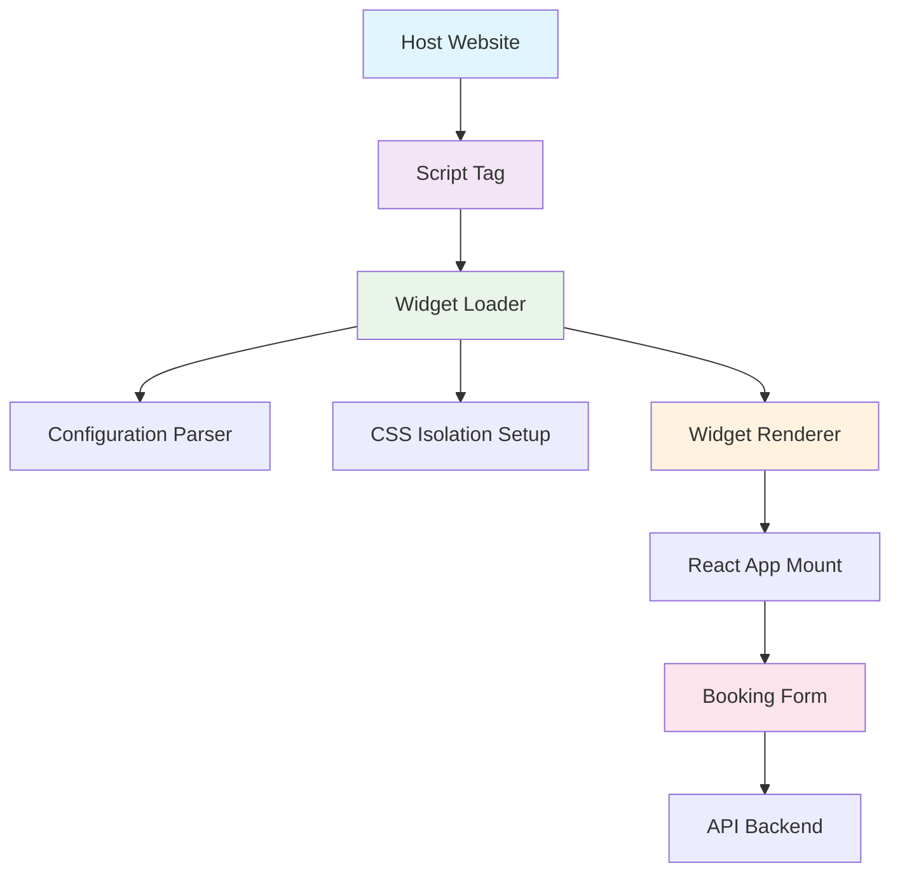
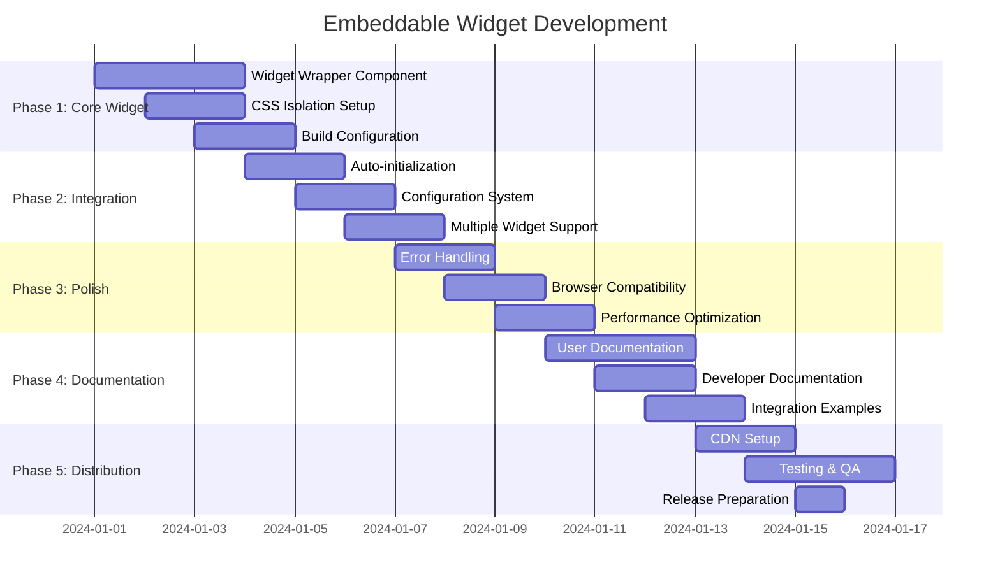

# Embeddable Booking Widget - Architecture & Implementation Plan

## 📋 Executive Summary

This document outlines the comprehensive plan to transform the existing React booking widget into an embeddable solution optimized for non-technical users. The approach prioritizes simplicity, compatibility, and security while maintaining the widget's full functionality.

## 🎯 Target Integration Method

**Primary Approach: Simple Script Tag Integration**
- Similar to Google Analytics, Calendly, or Typeform embeds
- Minimal technical knowledge required
- Copy/paste integration for maximum accessibility

## 🏗️ Architecture Overview



## 🚀 Integration Examples

### Basic Integration (Minimal Setup)
```html
<!-- Step 1: Add container div -->
<div id="booking-widget" 
     data-tenant-id="your-tenant-id"
     data-api-url="https://your-api.com/api/v1"></div>

<!-- Step 2: Add script tag -->
<script src="https://cdn.your-domain.com/booking-widget.js"></script>
```

### Advanced Configuration (Optional)
```html
<div id="booking-widget" 
     data-tenant-id="your-tenant-id"
     data-api-url="https://your-api.com/api/v1"
     data-theme="light"
     data-primary-color="#1677ff"
     data-width="800px"
     data-height="auto"
     data-language="en"></div>
<script src="https://cdn.your-domain.com/booking-widget.js"></script>
```

### Multiple Widgets on Same Page
```html
<!-- Widget 1 -->
<div class="booking-widget" 
     data-tenant-id="tenant-1"
     data-api-url="https://api1.com/api/v1"></div>

<!-- Widget 2 -->
<div class="booking-widget" 
     data-tenant-id="tenant-2"
     data-api-url="https://api2.com/api/v1"
     data-theme="dark"></div>

<script src="https://cdn.your-domain.com/booking-widget.js"></script>
```

## ⚙️ Widget Initialization System

### Auto-Discovery Process
1. **DOM Ready Detection**: Wait for DOM to be fully loaded
2. **Element Scanning**: Find all elements with `id="booking-widget"` or `class="booking-widget"`
3. **Configuration Parsing**: Extract data attributes from each element
4. **Validation**: Ensure required parameters are present
5. **Initialization**: Mount React app for each valid widget container

### Configuration Options

#### Required Parameters
- `data-tenant-id`: Unique identifier for the booking system tenant
- `data-api-url`: Base URL for the booking API

#### Optional Parameters
- `data-theme`: `"light"` | `"dark"` (default: `"light"`)
- `data-primary-color`: Hex color code (default: `"#1677ff"`)
- `data-width`: CSS width value (default: `"100%"`)
- `data-height`: CSS height value (default: `"auto"`)
- `data-language`: Language code (default: `"en"`)
- `data-container-class`: Additional CSS classes for styling

#### Callback Configuration (Advanced)
```html
<script>
window.BookingWidgetConfig = {
  onBookingComplete: function(bookingData) {
    console.log('Booking completed:', bookingData);
    // Custom success handling
  },
  onError: function(error) {
    console.error('Booking error:', error);
    // Custom error handling
  },
  onLoad: function(widgetId) {
    console.log('Widget loaded:', widgetId);
  }
};
</script>
```

## 🎨 CSS Isolation Strategy

### Primary Approach: Prefixed CSS Classes
- All widget styles prefixed with `.booking-widget-`
- CSS custom properties for theming
- Ant Design components scoped to prevent conflicts

### CSS Structure
```css
.booking-widget-container {
  /* CSS Custom Properties for theming */
  --bw-primary-color: #1677ff;
  --bw-border-radius: 6px;
  --bw-font-family: -apple-system, BlinkMacSystemFont, 'Segoe UI', Roboto, sans-serif;
  --bw-background: #ffffff;
  --bw-text-color: #000000;
  
  /* Container styles */
  font-family: var(--bw-font-family);
  color: var(--bw-text-color);
  background: var(--bw-background);
  border-radius: var(--bw-border-radius);
  box-sizing: border-box;
}

/* All Ant Design overrides prefixed */
.booking-widget-container .ant-btn-primary {
  background-color: var(--bw-primary-color);
  border-color: var(--bw-primary-color);
}
```

### Shadow DOM Fallback
- For maximum isolation in modern browsers
- Graceful degradation to prefixed CSS for older browsers
- Automatic detection and selection of best method

### Reset Styles
```css
.booking-widget-container * {
  box-sizing: border-box;
  margin: 0;
  padding: 0;
}
```

## 📦 Build & Distribution Strategy

### Build Configuration

#### Multiple Output Formats
1. **`booking-widget.js`** - Complete UMD bundle with all dependencies (~500KB)
2. **`booking-widget.min.js`** - Minified production version (~200KB gzipped)
3. **`booking-widget.modern.js`** - ES modules for modern browsers (~180KB)
4. **`booking-widget.css`** - Standalone CSS file (optional, ~50KB)

#### Vite Configuration Updates
```typescript
// vite.config.ts
export default defineConfig({
  build: {
    lib: {
      entry: 'src/widget/index.ts',
      name: 'BookingWidget',
      formats: ['umd', 'es'],
      fileName: (format) => `booking-widget.${format}.js`
    },
    rollupOptions: {
      external: [], // Bundle all dependencies
      output: {
        globals: {}
      }
    }
  }
})
```

### CDN Distribution Strategy

#### Primary CDN Options
1. **jsDelivr**: `https://cdn.jsdelivr.net/npm/booking-widget@latest/dist/booking-widget.min.js`
2. **unpkg**: `https://unpkg.com/booking-widget@latest/dist/booking-widget.min.js`
3. **Custom CDN**: `https://cdn.your-domain.com/booking-widget.js`

#### Version Management
- Semantic versioning (e.g., `v1.2.3`)
- Latest version alias for auto-updates
- Specific version pinning for stability

#### Fallback Strategy
```html
<script>
  // Primary CDN
  var script = document.createElement('script');
  script.src = 'https://cdn.jsdelivr.net/npm/booking-widget@latest/dist/booking-widget.min.js';
  script.onerror = function() {
    // Fallback CDN
    var fallback = document.createElement('script');
    fallback.src = 'https://unpkg.com/booking-widget@latest/dist/booking-widget.min.js';
    document.head.appendChild(fallback);
  };
  document.head.appendChild(script);
</script>
```

## 🔒 Security & Compatibility

### Security Measures

#### Content Security Policy (CSP) Compliance
```html
<!-- CSP-friendly implementation -->
<meta http-equiv="Content-Security-Policy" 
      content="script-src 'self' https://cdn.your-domain.com; 
               style-src 'self' 'unsafe-inline' https://cdn.your-domain.com;">
```

#### XSS Protection
- All user inputs sanitized before rendering
- HTML encoding for dynamic content
- Strict validation of configuration parameters

#### CORS Configuration
```javascript
// API calls with proper CORS headers
const apiClient = axios.create({
  baseURL: apiUrl,
  headers: {
    'Content-Type': 'application/json',
  },
  withCredentials: false // Avoid credentials in cross-origin requests
});
```

#### Data Security
- HTTPS-only API communication
- No sensitive data stored in localStorage
- Secure token handling for API authentication

### Browser Compatibility

#### Target Support
- **Modern Browsers**: Chrome 80+, Firefox 75+, Safari 13+, Edge 80+
- **Mobile**: iOS Safari 13+, Chrome Mobile 80+
- **Fallbacks**: Polyfills for older browsers if needed

#### Feature Detection
```javascript
// Check for required features
const isSupported = () => {
  return (
    'Promise' in window &&
    'fetch' in window &&
    'Map' in window &&
    'Set' in window
  );
};
```

## 📚 Documentation Structure

### End User Documentation (Non-Technical)

#### 1. Quick Start Guide
```markdown
# Quick Start - Embed in 2 Minutes

## Step 1: Get Your Configuration
- Tenant ID: `your-tenant-id`
- API URL: `https://your-api.com/api/v1`

## Step 2: Add to Your Website
Copy and paste this code where you want the booking widget:

[HTML code example]

## Step 3: Customize (Optional)
Change colors, size, and theme with simple attributes:

[Customization examples]
```

#### 2. Platform-Specific Guides
- **WordPress**: Plugin installation + shortcode usage
- **Shopify**: Theme integration guide
- **Squarespace**: Code block integration
- **Wix**: HTML embed instructions
- **Static Sites**: Direct HTML integration

#### 3. Visual Configuration Tool
- Interactive widget builder
- Live preview with configuration changes
- Generated embed code
- Copy-to-clipboard functionality

#### 4. Troubleshooting Guide
```markdown
# Common Issues & Solutions

## Widget Not Appearing
- Check if script is loaded
- Verify container element exists
- Check browser console for errors

## Styling Conflicts
- Use CSS isolation options
- Check for conflicting stylesheets
- Use Shadow DOM mode

## API Connection Issues
- Verify API URL is correct
- Check CORS configuration
- Ensure HTTPS is used
```

### Developer Documentation

#### 1. API Reference
```markdown
# Configuration API

## Required Attributes
- `data-tenant-id`: string - Unique tenant identifier
- `data-api-url`: string - Base API URL

## Optional Attributes
- `data-theme`: 'light' | 'dark' - Widget theme
- `data-primary-color`: string - Hex color code
- `data-width`: string - CSS width value
- `data-height`: string - CSS height value

## JavaScript API
- `BookingWidget.init(config)` - Manual initialization
- `BookingWidget.destroy(widgetId)` - Remove widget instance
- `BookingWidget.updateConfig(widgetId, config)` - Update configuration
```

#### 2. Customization Guide
```markdown
# Advanced Customization

## CSS Custom Properties
Override widget styling using CSS variables:

```css
.booking-widget-container {
  --bw-primary-color: #your-color;
  --bw-border-radius: 8px;
  --bw-font-family: 'Your Font', sans-serif;
}
```

## Event Handling
Listen to widget events:

```javascript
window.addEventListener('bookingWidgetComplete', function(event) {
  console.log('Booking completed:', event.detail);
});
```

#### 3. Integration Examples
- React application integration
- Vue.js integration
- Angular integration
- Vanilla JavaScript usage
- Server-side rendering considerations

#### 4. Build & Development
```markdown
# Development Setup

## Prerequisites
- Node.js 18+
- npm or yarn

## Installation
```bash
git clone [repository]
cd booking-widget
npm install
```

## Development
```bash
npm run dev          # Start development server
npm run build        # Build for production
npm run build:widget # Build embeddable widget
```

## Testing
```bash
npm run test         # Run unit tests
npm run test:e2e     # Run end-to-end tests
npm run test:widget  # Test widget integration
```

## 🚀 Implementation Timeline



## 📁 File Structure Changes

```
src/
├── components/
│   ├── App/                    # Existing app component
│   ├── booking/               # Existing booking components
│   └── widget/                # NEW: Widget-specific components
│       ├── WidgetContainer.tsx
│       ├── WidgetLoader.tsx
│       └── WidgetConfig.ts
├── widget/                    # NEW: Widget entry point
│   ├── index.ts              # Main widget initialization
│   ├── loader.ts             # Auto-discovery and loading
│   ├── config.ts             # Configuration management
│   └── styles.css            # Widget-specific styles
├── styles/
│   ├── App.css               # Existing styles
│   └── widget.css            # NEW: Isolated widget styles
└── types/
    └── widget.d.ts           # NEW: Widget type definitions
```

## 🎯 Success Metrics

### Technical Metrics
- **Bundle Size**: < 250KB gzipped
- **Load Time**: < 2 seconds on 3G
- **Browser Support**: 95%+ compatibility
- **API Response**: < 500ms average

### User Experience Metrics
- **Integration Time**: < 5 minutes for basic setup
- **Error Rate**: < 1% initialization failures
- **Performance**: 60fps animations, smooth interactions
- **Accessibility**: WCAG 2.1 AA compliance

## 🔄 Follow-up Development Tasks

### Immediate (Post-Implementation)
1. **Performance Monitoring**: Set up analytics for widget usage
2. **Error Tracking**: Implement error reporting system
3. **A/B Testing**: Test different initialization methods
4. **User Feedback**: Collect integration experience feedback

### Future Enhancements
1. **Framework Integrations**: React/Vue/Angular components
2. **Advanced Theming**: Visual theme builder
3. **Analytics Integration**: Google Analytics, custom tracking
4. **Internationalization**: Multi-language support
5. **Accessibility**: Enhanced screen reader support
6. **Mobile Optimization**: Touch-friendly interactions

## 📞 Support & Maintenance

### Support Channels
- **Documentation**: Comprehensive guides and examples
- **GitHub Issues**: Bug reports and feature requests
- **Developer Forum**: Community support
- **Email Support**: Direct technical assistance

### Maintenance Plan
- **Regular Updates**: Monthly releases with improvements
- **Security Patches**: Immediate response to vulnerabilities
- **Browser Updates**: Compatibility testing with new browser versions
- **API Changes**: Backward compatibility maintenance

---

## 🎉 Conclusion

This plan provides a comprehensive roadmap for creating a highly embeddable, user-friendly booking widget that maintains all existing functionality while being accessible to non-technical users. The approach prioritizes simplicity, security, and compatibility while providing extensive customization options for advanced users.

The implementation will result in a professional-grade embeddable widget comparable to industry standards like Calendly, Typeform, or Google Maps embeds, with the added benefit of being specifically tailored to your booking system's requirements.